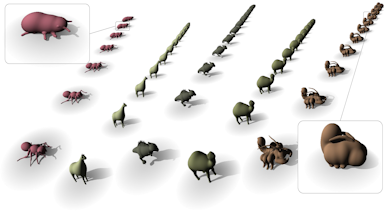
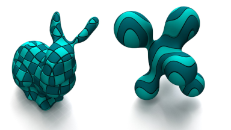

# 2026

## Extreme continuous level of detail for skeleton-based implicit surfaces

P. Hubert-Brierre, M.P. Cani, E. Galin.

[Computers & Graphics, 138(104646), Proceedings of SMI, 2026.](https://www.sciencedirect.com/science/article/pii/S0097849326001172)

[PDF](2026_SMI/2026_Extreme_LOD.pdf)
[Video](2026_SMI/2026_Extreme_LOD.mp4)

## The PhaseTree: Multiphase Signed Distance Fields

P. Hubert-Brierre, M.P. Cani, E. Galin.

[ACM Transactions on Graphics, 45(4), Proceedings of SIGGRAPH, 2026.](https://dl.acm.org/doi/10.1145/3811379)

[PDF](2026_ACM_TOG/2026-phasetree.pdf)
[Code](https://github.com/Arches-Team/PhaseTree)

# 2025

## Accelerating Signed Distance Functions

P. Hubert-Brierre, E. Guérin, A. Peytavie, E. Galin.

Computer Graphics Forum, 44(7), Proceedings of Pacific Graphics, 2025.
[HAL](https://hal.science/hal-05308455v1)

[Code Light](https://www.shadertoy.com/view/Wf2yRz)
[Code Heavy](https://www.shadertoy.com/view/wcBczm)
[PDF](2025-lod.pdf)
[Video](https://www.youtube.com/watch?v=YW6rxDClytI)