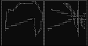
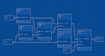
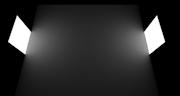
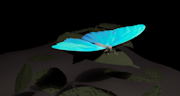
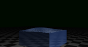
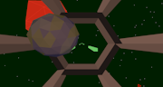

---
	

	
**PermHB** : Very optimized c++ code to brut force the traveling salseman problem using extensive CPU paralelism (using standart c++ thread, using intrisic function and hand made number representation to decuplate the number of threads). [Code](https://github.com/Pierre-HB/PermHB)

---

**BluePrint Maker**: Side project using ImGui to create a node interface describing a flow graph. Using sparce matrix representation and inversion to solve the graph. [Code](https://github.com/Pierre-HB/BluePrintMaker)

---

**End of master internship (2023)**: Defensive sampling for monte carlo renderer. 

---	
	

**End of licence internship (2021)**: Simulate the "Thin layer" phenomena to create BRDF. [Repport](rapport_stage_2021_Pierre_Hubert-Brierre.pdf)

---

My **TIPE** (end of prep school informatic project): Rendering of water using implicit surfaces in a hand made sphere tracing renderer. [Code](https://github.com/Pierre-HB/TIPE)

---	
	
**French computer science TD** writen for my schoolmates:
- Introduction to genetic algorithms. [Subject](Algorithmes_genetiques.pdf), [Code](https://github.com/Pierre-HB/TD-Informatique/tree/master/TD%20Algorithmes%20g%C3%A9n%C3%A9tiques)
- Very long prime generator. [Subject](Grands_nombres_premiers.pdf), [Code](https://github.com/Pierre-HB/TD-Informatique/tree/master/TD%20Grand%20nombre%20premier)
- Introduction to video game : coding Snake. [Subject](TP_Snake.pdf), [Code](https://github.com/Pierre-HB/TD-Informatique/tree/master/TD%20Snake)
- Introduction to Perlin Noise. [Subject](Bruit_de_Perlin.pdf), [code](https://github.com/Pierre-HB/TD-Informatique/tree/master/TD%20bruit%20de%20Perlin)

---

**Evwayu** : a 3D game about space vessel fighting, written in Ocaml for a scool project. [Code](https://github.com/Pierre-HB/-vway-/tree/master)
