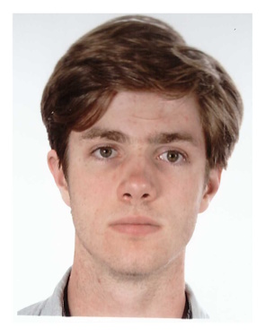

# Bio
I am a PhD student at the Universitée Claude Bernard Lyon 1 and the Ecole Polytechnique since September 2024. My PhD is entitled "Multi scale virtual world modeling using implicit surfaces".

# Diploma

 - 2024 **ENS Certificate** in Computer Science
 - 2023 **Master of Science ID3D** in Computer Graphics
 - 2022 **Cambridge Advanced**
 - 2021 **Honour Degree** in Mathematics
 - 2021 **Honour Degree** in Computer Science
 - 2018 **Baccalaureate** in Science